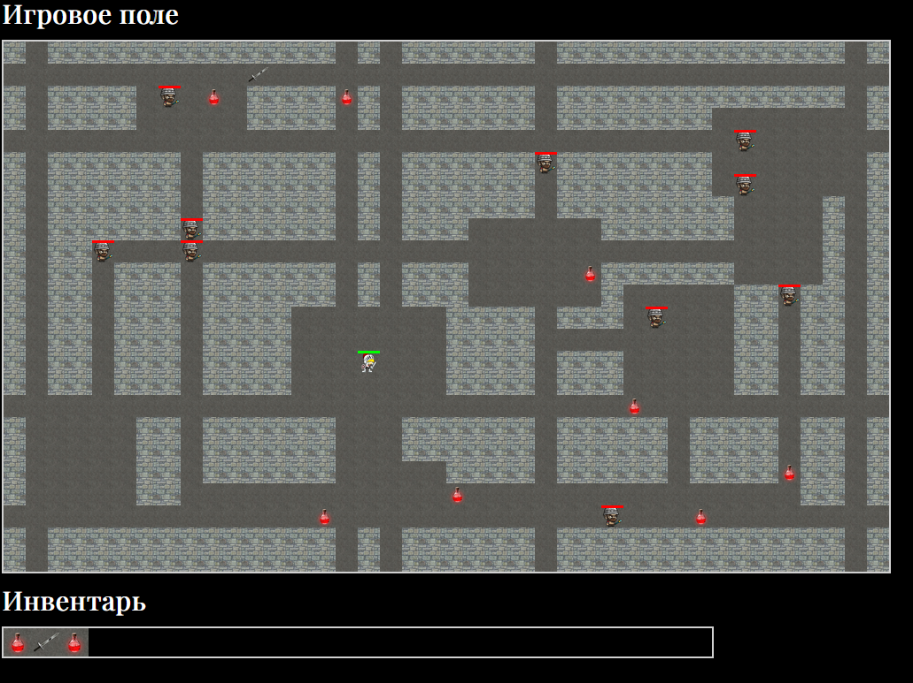

# 🧱 Rogue Game — Рогалик на JavaScript

Простая браузерная 2D-игра в жанре **roguelike**, реализованная на чистом JavaScript(ES5) и jQuery. Игрок управляет героем, который сражается с врагами, подбирает зелья и мечи, и собирает их в инвентарь.



## 🎮 Основной функционал

- **Генерация карты**: каждая игра начинается с процедурной генерации поля с врагами, стенами и предметами. Исключена возможноность генерации "закрытых" комнат в которые нельзя попасть.
- **Движение игрока**: с помощью клавиш `WASD` (`ЦФЫВ` для русской раскладки).
- **Инвентарь**: все подобранные предметы отображаются в нижней панели инвентаря.
- **Предметы**:
  - 🧪 **Зелья** восстанавливают здоровье.
  - ⚔️ **Мечи** увеличивают урон.
- **Сражения**:
  - Герой атакует врагов в соседних клетках с помощью клавишы `Пробел`
  - Враги ходят и наносят урон герою, если он рядом.
- **Победа/поражение**:
  - Победа — при уничтожении всех врагов.
  - Поражение — при смерти героя.
  - При любом исходе игра завершает обработку ввода (`keydown` отключается).

## 🛠️ Используемые технологии

- HTML, CSS
- JavaScript (ES5)
- jQuery

## 📦 Структура проекта

<pre>
project-root/
│
├── index.html             
├── images/                
├── game/
│   ├── Game.js            
│   ├── mapGenerator.js    
│   ├── rendering.js       
│   ├── movement.js        
│   ├── combat.js          
│   ├── input.js           
│   └── utils.js           
└── README.md
</pre>

## 🚀 Как запустить

### 1. Клонируйте репозиторий:

```bash
git clone https://github.com/BomBletTM/rogue-game.git
cd rogue-game
```

### 2. Откройте `index.html` в браузере (двойной клик)
